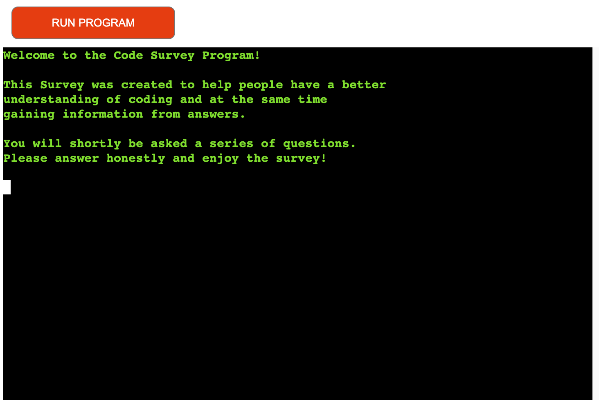

# Coding Survey

Coding Survey is a project configure using python, there are a series of question with relative sub-questions and answer options.The result of each question will be append link to Google Spreadsheet for Statistics.

[Coding Survey live site](https://code-survey-796d494db436.herokuapp.com/)

---

## Table of Contents

### [User Experience (UX)](#user-experience-ux-1)

- [User Stories](#user-stories)

### [Features](#features)

- [Existing Features](#existing-features)

### [Features Left to Implement](#features-left-to-implement-1)

### [Technologies Used](#technologies-used-1)

### [Frameworks, Libraries & Programs Used](#frameworks-libraries--programs-used-1)

### [Testing](#testing-1)

- [Code validation](#code-validation)

### [Unfixed Bugs](#unfixed-bugs-1)

### [Deployment and local development](#deployment-and-local-development-1)

### [Credits](#credits-1)

### [Acknowledgements](#acknowledgements-1)

## User Experience (UX)

The site is aimed at people who want to take survey and want to help getting statistics from answers.

### User Stories

- First-time visitor goals
  - As a user I would like to understand the purpose of the survey.
  - As a user I would like to choose whether to take the survey or not.
  - As a user I would like to have an option to choose from the answer.
  - I might have a typo error when enter the choose number, as a user I would like to be inform and try again.
  - I might have a typo error when enter the name, as a user I would like to be inform what characters to insert and try again.
  - As a user I would like to choose to see user statistics.
  - As a user I would like to have an option to choose to confirm exit or change my mind to take the survey.

- Frequent user goals
  - Check if there are any update of the survey or more questions added.

---

## Features

- Collect user coding information.
- Store the result data in Google spreadsheet.
- Collect user answers for the survey.
- View user statistics.

### Existing Features

- Title section
  - Include a initial loading system.
  - An explanation about the purpose of this survey.

- Enter name section
  - Include a enter name section.
  - If the input of the name is wrong, the error will show explaining the correct characters to enter.

- Survey menù section
  - Include the menù of the survey.
  - The user can choose 3 options.The first option the survey will start.

- First Question
  - Include the first question.
  - The user can choose 4 options.
  - If the user insert the wrong number option,a relative error will show.

- First Sub-Question
  - Include the first Sub-question.
  - The user can choose 4 options.
  - If the user insert the wrong number option,a relative error will show.

- Second Question
  - Include the second question.
  - The user can choose 3 options.
  - If the user insert the wrong number option,a relative error will show.

- Second Sub-Question
  - Include the second Sub-question.
  - The user can choose 3 options.
  - If the user insert the wrong number option,a relative error will show.

- Third Question
  - Include the third question.
  - The user can choose 3 options.
  - If the user insert the wrong number option,a relative error will show.

- Third Sub-Question
  - Include the third Sub-question.
  - The user can choose 3 options.
  - If the user insert the wrong number option,a relative error will show.

- Fourth Question
  - Include the fourth question.
  - The user can choose 2 options.
  - If the user insert the wrong number option,a relative error will show.

- Fourth Sub-Question
  - Include the fourth Sub-question.
  - The user can choose 2 options.
  - If the user insert the wrong number option,a relative error will show.

- Fifth Question
  - Include the fifth question.
  - The user can choose 3 options.
  - If the user insert the wrong number option,a relative error will show.

- Fifth Sub-Question
  - Include the fifth Sub-question.
  - The user can choose 3 options.
  - If the user insert the wrong number option,a relative error will show.

- Sixth Question
  - Include the sixth question.
  - The user can choose 4 options.
  - If the user insert the wrong number option,a relative error will show.

- Sixth Sub-Question
  - Include the sixth Sub-question.
  - The user can choose 5 options.
  - If the user insert the wrong number option,a relative error will show.

- End Survey
  - The survey will end.
  - The survey menú will appear again to let users to choose.

- Statistic section
  - Include the user choice statistics in relative percentual.
  - First image will show a empty user statistics.

- Exit choice
  - The user can choose to exit definitively the survey.

---

## Features Left to Implement

* Insert more questions and sub-questions.
* Insert choice to see individual user answer questions before survey completed.
* Insert choice to submit or not the survey at the end of the questions.

---

## Technologies Used

- [PYTHON](https://en.wikipedia.org/wiki/Python_(programming_language))

---

## Frameworks, Libraries & Programs Used

- [Heroku](https://dashboard.heroku.com/apps)
  - Platform as a service (PaaS) that was used to host and deploy the finished project.
- [Codeanywhere](https://codeanywhere.com/platform)
  - Program used for coding
- [Github](https://github.com/)
  - Deployment of the website and storing the files online.
- [Colorama](https://pypi.org/project/colorama/)
  - Library used to style the text with color to improve UX and readability.
- [Gspread](https://docs.gspread.org/en/v6.0.0/)
  - API for Google sheets use to store survey data.

---

### Deployment and local development

The program was developed in Codeanywhere. It was then committed and pushed to GitHub. The finished project was deployed in Heroku using the Code Institute Python Terminal for display purposes. Deployment to Heroku was completed using the following steps:

- Run 'pip3 freeze > requirements.txt' in the terminal to add a list of dependencies to requirements.txt .
- Commit these changes and push to GitHub.
- Open and login to Heroku.
- From the dashboard, click 'New', then click 'Create new app'.
- Enter the App name, choose a region, then click 'Create app'.
- Navigate to the 'Settings' tab.
- Within 'Settings', navigate to 'Config Vars'.
- Two config vars need to be added using the following 'KEY' and 'VALUE' pairs:
  KEY = 'CREDS', VALUE = Copy and paste the entire contents of the creds.json file into this field. Then click 'Add'.
  KEY = 'PORT', VALUE = '8000'. Then click 'Add'.
- Within 'Settings', navigate to 'Buildpack'.
- Click 'Add buildpack'. Select 'Python', then click 'Save changes'.
- Click 'Add buildpack' again. Select 'nodejs', then click 'Save changes'.
  Ensure that these buildpacks are in the correct order: Python on top and nodejs underneath.
  If they are in the wrong order, click and drag to fix this.
- Navigate to the 'Deploy' tab.
- Within 'Deploy', navigate to 'Deployment method'.
- Click on 'GitHub'. Navigate to 'Connect to GitHub' and click 'Connect to GitHub'.
- Within 'Connect to GitHub', use the search function to find the repository to be deployed. Click 'Connect'.
- Navigate to either 'Automatic Deploys' or 'Manual Deploys' to choose which method to deploy the application.
- Click on 'Enable Automatic Deploys' or 'Deploy Branch' respectively, depending on chosen method.
- Once the app is finished building, a message saying 'Your app was successfully deployed' will appear.
- Click 'View' to see the deployed app.

---

### Credits

### Code

- Understanding various concepts of Python [w3schools](https://www.w3schools.com/python/default.asp)
- The Project 3 template was helpfully provided by [Code Institute (template)](https://github.com/Code-Institute-Org/p3-template)

### Content

- All content was created and written by Antonio Cesarino, the developer.

---

### Acknowledgements

- My mentor Mitko Bachvarov provided amazing feedback and guidance.He assisted me with important suggestions during all steps for my project.
- Code Institute and Slack community for encouragement and information.

---